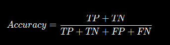
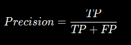
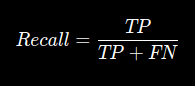
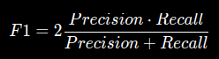
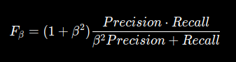

# ...

## 1. Confusion matrix

У нас есть бинарная классификация:

```
1 = мошенничество
0 = нормальная транзакция
```

Модель для каждой транзакции говорит 0 или 1.

|                   | Реально 1 | Реально 0 |
| ----------------- | --------: | --------: |
| **Предсказали 1** |        TP |        FP |
| **Предсказали 0** |        FN |        TN |

### True Positive (TP)

Модель предсказала позитивный ответ и действительно было позитивным.

### True Negative (TN)

Модель предсказала негативный ответ, и он действительно был негативный.

### False Positive (FP)

Модель предсказала позитвный ответ, но на самом деле он был негативным.

### False Negative (FN)

Модель предсказала негатиный ответ, но на самом деле он был позитивным.

## 2. Accuracy



> Какую долю всех объектов модель классифицировала правильно?

Учитывает и правильные **positive**, и правильные **negative**. Но если размерность позитивного класса подавлена размером негативного класса, **accuracy** будет неверной!!!

## 3. Precision



> Из всех объектов, которые модель назвала положительными, сколько действительно положительных?

```
модель объявила 100 транзакций мошенническими

TP = 80
FP = 20
```

Тогда:

```
Precision = 80 / 100 = 0.8
```

Нужно, когда мы хотим минимизировать число ложнопозитивных срабатываний.

## 4. Recall



> Из всех реально положительных объектов сколько модель смогла найти?

```
реально было 100 мошеннических транзакций

TP = 80
FN = 20
```

Тогда:

```
Recall = 80 / 100 = 0.8
```

Нужно, когда мы хотим минимизировать число ложнонегативных срабатниваний.

## 5. Threshold

Порог вероятности, после которого мы классифицируем ситуацию как позитивную, до - негативную.

## 6. F1

Что если нам важны и **Precision**, и **Recall**?



Это их гармоническое среднее. Оно сильнее, чем обычное среднее, штрафует ситуацию, когда одна из метрик очень маленькая.

```
Precision = 1.0
Recall = 0.1
```

Обычое среднее:
`0.55`

F1:
`~0.18`

## 7. F-β

**F1** одинаково учитывает **Precision** и **Recall**. Но что если нам требуется учет чего-то одного сильнее, чем другого?



```
β > 1 → Recall важнее
β < 1 → Precision важнее
β = 1 → Precision и Recall равны
```
