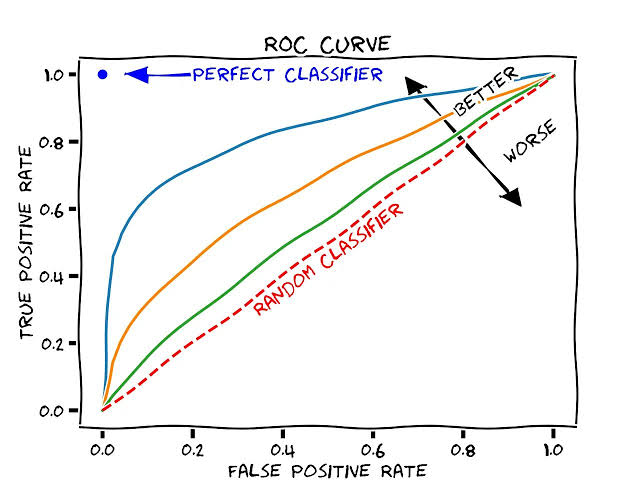
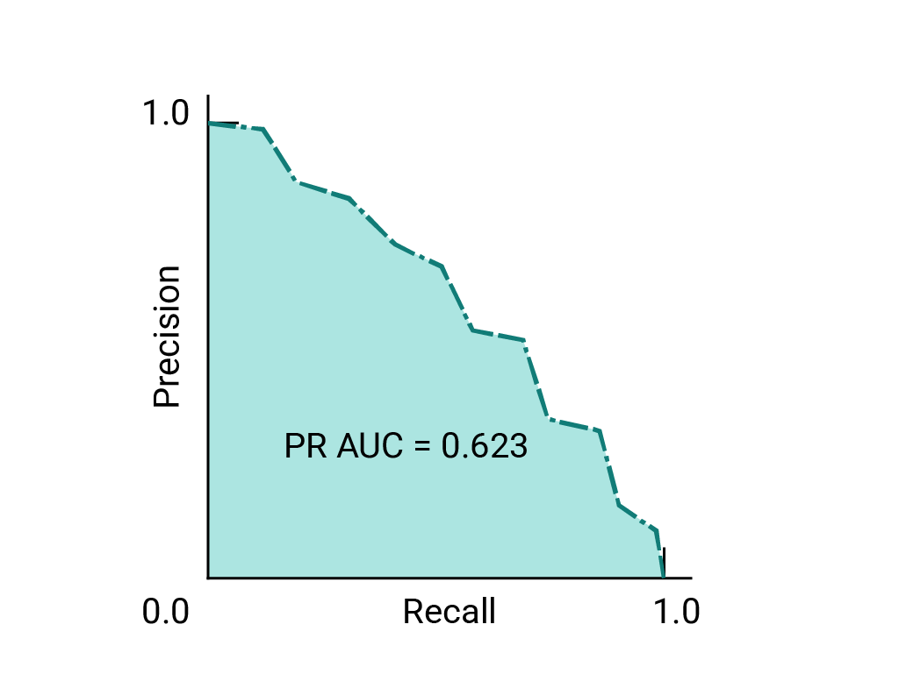
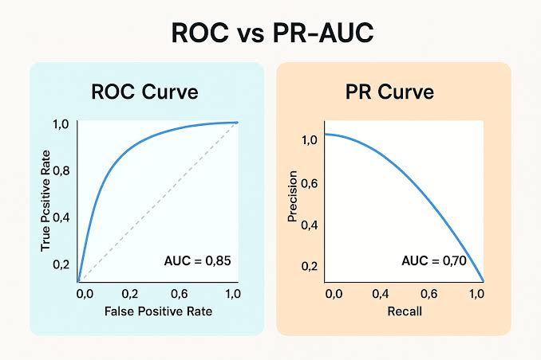
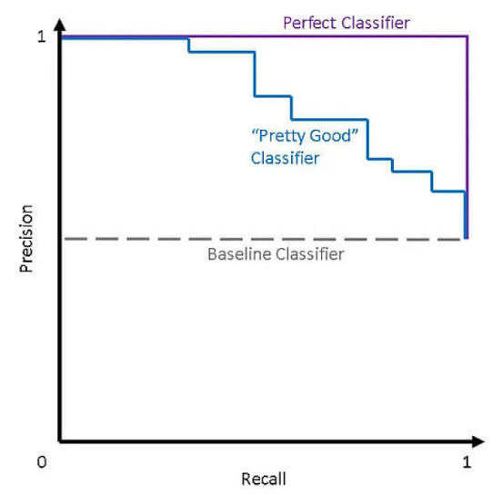
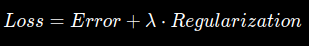
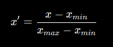

# ML

## 1. Confusion matrix

Для бинарного классификатора:

|                | Факт 1 | Факт 0 |
| -------------- | -----: | -----: |
| Предсказание 1 |     TP |     FP |
| Предсказание 0 |     FN |     TN |

- TP — сказал «1», и действительно 1
- FP — сказал «1», но на самом деле 0
- FN — сказал «0», но на самом деле 1
- TN — сказал «0», и действительно 0

## 2. Precision vs Recall + Accuracy + F1

### Precision

Из всех объектов, которым модель сказала "1", сколько действительно оказались 1?

`Precision = TP / (TP + FP)`

### Recall

Из всех реально положительных объектов сколько модель нашла:

`Recall = TP / (TP + FN)`

### Accuracy

Какую часть объектов модель предсказала верно:

`Accuracy = (TP + TN) / (TP + TN + FP + FN)

### F1

Что если нам важны и **Precision**, и **Recall**?

`F1 = 2 * (Recall * Precision) / (Recall + Precision)`

Это их гармоническое среднее. Оно сильнее, чем обычное среднее, штрафует ситуацию, когда одна из метрик очень маленькая.

### Пример 1

Пусть модель выдала следующие результаты:

- TP = 80
- FP = 20
- FN = 40
- TN = 860

1. Accuracy = (80 + 860) / (80 + 20 + 40 + 860) = 940 / 1000 = 0.94
2. Precision = 80 / (80 + 20) = 0.8
3. Recall = 80 / (80 + 40) = 8 / 12
4. F1 = 2 _ (0.8 _ 8 / 12) / (0.8 + 8 / 12) = 0.72

### Пример 2

У модели:

`Precision = 0.8`

Модель предсказала положительный класс для 150 объектов.
При этом реально положительных объектов было 240.

Найти:

- TP
- FP
- FN
- Recall

Решение:

Из условия (TP + FP) = 150, (TP + FN) = 240.
Precision = TP / (TP + FP)
Тогда TP / 150 = 0.8
TP = 120
-> FP = 150 - 120 = 30
-> FN = 240 - 120 = 120
Recall = TP / (TP + FN) = 120 / 240 = 0.5

## 3. ROC-AUC / PR-AUC

Пусть у классификатора есть не только ответ (0 или 1), но он часто выдаёт **score**:

```
Анна → 0.91
Борис → 0.73
Катя → 0.42
Дмитрий → 0.18
```

А потом мы выбираем `threshold`, к примеру `0.5`:

```
score >= 0.5 → positive
score < 0.5  → negative
```

> Насколько хорошо модель вообще умеет ранжировать положительные объекты выше отрицательных, независимо от конкретного threshold?

Так появляется **ROC-AUC**.

### ROC-кривая

Она рассматривает разные **threshold** и для каждого смотрит:

- **TPR** - Recall = TP / (TP + FN)
- **FPR** - FP / (FP + TN)




Таким образом, ROC показывает:

> насколько хорошо мы находим positive, пока при этом допускаем false positive.

Но как понять threshold?

### ROC-AUC (area under the curve)

> Это площадь под ROC-кривой.

- `AUC = 1` - то у нас идеальная модель.
- `AUC = 0.5` - модель примерно случайная (диагональ).
- `AUC < 0.5` - модель хуже случайного. Она хорошо ранжирует, но в обратную сторону.

### PR-кривая

> PR = Precision-Recall

### PR-AUC

> Показывает, насколько модель хорошо одновременно поддерживает высокий **precision** при разных уровнях **recall**.





## 4. Logistic Regression

Допустим, хотим определить:

> мошенник / не мошенник

Модель сначала считает некоторый score:

`z = w₁x₁ + w₂x₂ + ... + b`

А затем пропускает его через **sigmoid**, которая превращает любое число в число от 0 до 1.

Тем самым порождаются **threshold** и **score**.

- используется для классификации
- сначала вычисляет линейную комбинацию признаков
- sigmoid превращает её в число от 0 до 1
- это число можно использовать как score/оценку вероятности положительного класса
- threshold превращает score в 0/1
- изменение threshold меняет Precision, Recall, FPR и тд
- поэтому Logistic Regression естественно связана с ROC-AUC и PR-AUC

## 5. Log Loss / binary cross-entropy

Например, модель предсказывает вероятность мошенничества:

| Объект | Реальный класс | Предсказание |
| ------ | -------------: | -----------: |
| A      |              1 |          0.9 |
| B      |              1 |          0.6 |
| C      |              0 |          0.2 |
| D      |              0 |          0.8 |

Модель ошиблась на D: она очень уверенно сказала `0.8`. Нам нужен способ сказать модели:

> Насколько плохо ты сейчас предсказала?

Для одного объекта binary cross-entropy:

**если y = 1**:

`Loss = -log(p)`

**если y = 0**:

`Loss -log(1 - p)`

Поэтому общая формула:

`Log Loss = -[y * log(p) + (1 - y) * log(1 - p)]`

## 6. Linear Regression

Предсказываем число с помощью лин моделей.

### MAE

**Mean Absolute Error** - средняя абсолютная ошибка.

### MSE

**Mean Squared Error** - средняя квадратичная ошибка.

> Минимизация MSE связана с предсказанием условного среднего целевой переменной.

### RMSE

**RMSE = sqrt(MSE)**

Возвращаем те же единицы измерения из квадратных.

## 7. L1 / L2 regularisation

Представим линейную/логистическую модель. Модель подбирает коэффициенты `w1, w2, ..., wn, b`, чтобы хорошо предсказать данные.

> НО: модель может слишком сильно подстраиваться под обучающую выборку.

Большие коэффициенты могут означать, что модель очень резко реагирует на небольшие изменения признаков.

Это **переобучение**.

Регуляризация добавляет модели штраф:

> Ты можешь уменьшать ошибку, но за слишком сложную модель придётся платить.

То есть:

**Общая функция потерь = ошибка модели + штраф за сложность**.

### L1-регуляризация

L1 добавляет сумму модулей коэффициентов:

`|w1| + |w2| + ... + |wn|`

Главная особенность L1:

> Она может сделать некоторые коэффициенты ровно равными 0.

То есть она выполняет отбор признаков.

### L2-регуляризация

L2 использует квадраты коэффициентов:

`w1 ^2 + w2 ^2 + ... + wn ^2`

> Она обычно не зануляет коэффициенты полностью, но гораздо сильнее режет большие коэффициенты.

### alpha / λ

Обычно формула выглядит так:



где `alpha` - сила регуляризации.

- alpha ~= 0 -> маленькая регуляризация
- alpha > 1 -> нормальная/большая регуляризация

Если регуляризация слишком жесткая, модель может начать недообучаться.

## 8. Scaling

### StandartScaler


После scaling признак обычно имеет:

- среднее около `0`.
- стандартное отклонение около `1`.

### Min-Max Scaling



Получаем диапазон `[0, 1]`.

### RobustScaler

Если много выбросов, можно использовать его.

> Вместо среднего и стандартного отклонения используем более устойчивые к выбросам статистики.

### One-Hot Encoding

У нас есть категориальный признак, а модели нужны числа. Данный алгоритм создает отдельный бинарный признак для каждой категории.

> One-Hot Encoding превращает одну категориальную колонку в несколько колонок 0/1.

## 9. Pipeline

```python
from sklearn.pipeline import Pipeline
from sklearn.preprocessing import StandartScaler
from sklearn.linear_model import LogisticRegression

model = Pipeline([
    ("scaler", StandartScaler()),
    ("model", LogisticRegression())
])

При Cross-Validation skelarn сам делает:
```

```
fold 1:
train fold → fit scaler → transform train
                         → transform validation
                         → train model

fold 2:
новый train → новый fit scaler → validation
...
```

## 10. Decision Tree - дерево решений

> Модель задаёт последовательность вопросов о признаках и по ответам приходит к предсказанию.

Как разделять дерево, чтобы получать дочерние узлы, где классы распределены как можно более однородно?

### Gini impurity

Для бинарной классификации:

`Gini = 1 - p₀² - p₁²`

где `p₀` и `p₁` - доли объектов двух классов.

> Чем меньше Gini, тем чище узел.

### Entropy

`Entropy = -Σ pᵢ log₂(pᵢ)`

При равномерном распределении классов энтропия максимальна.

```
Gini / Entropy
      ↓
измеряют нечистоту узла
      ↓
дерево ищет хорошие splits
      ↓
после split дочерние узлы становятся чище
```

### Split

Это условие, по которому мы разделяем объекты.

### Ограничения дерева от переобучения:

- max_depth (максимальная глубина дерева)
- min_samples_split (минимальное количество объектов, необходимое для разделения узла)
- min_saples_lead (минимальное количество объектов, которое должно остаться в каждом листе)

```
Decision Tree
      ↓
ищет split
      ↓
разделяет данные
      ↓
стремится сделать узлы чище
      ↓
Gini / Entropy
      ↓
слишком глубокое дерево
      ↓
overfitting
      ↓
max_depth / min_samples_split / min_samples_leaf
```

## 11. Random Forest - рандомный лес

Это ансамбль из деревьев. Каждое обучается на своей случайной выборке и случайных признаках, потом каждое голосует. Решение выбирает демократично (большиснтво голосов).

### Bootstrap - разные выборки объектов

Для каждого дерева Random Forest берет случайную выборку объектов из train **с возвращением**.

### Fearure subsampling - случайные признаки

Каждое дерево берет случайное подмножество признаков.
